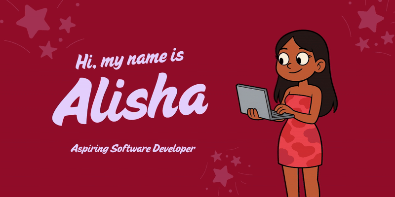

  

  

<h3><b style="font-size: 16px;">UI Engineer, Business Analyst, Integration Engineer</b></h3>

 
     I'm a final-year Computer Science student with a deep passion for computers and a curiosity about all things virtual — from immersive digital worlds to the complex systems that power them. I’m dedicated to honing my skills and evolving as a software developer and engineer, constantly exploring how technology can be used to solve real-world problems.

My fascination with technology, paired with my love for problem-solving, has driven me to pursue a career in Software Development. I enjoy designing and building clean, efficient, and scalable software — whether that’s developing intelligent systems, creating interactive simulations, or experimenting with full-stack web applications.

When I’m not coding, you’ll probably find me at the gym, cooking for friends and family, or hiking outdoors to recharge and find inspiration.
        

  

      

 
  

  

<h3><b style="font-size: 14px;">Frontend Development</h3>
  

<h3><b style="font-size: 14px;">Backend Development</h3>
    

<h3><b style="font-size: 14px;">Project Management & Deployment</h3>
   

<h3><b style="font-size: 14px;">Testing</h3>
    
  

<!-- GitHub Stats Section -->

  

  
  <!-- Main Stats and Streak Side by Side -->
  

    
    
  

  
  <!-- Top Languages -->
  
  
  <!-- Contribution Graph -->
  

  

     

  
  
  
  

  

