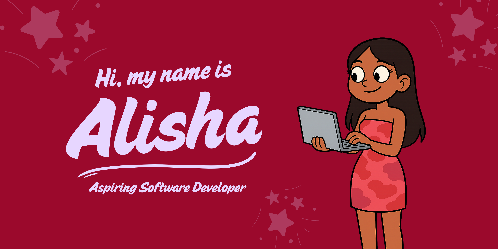

  <h1 align="center"> Hi, Im Alisha Perumal
  </h1>

<h1 align="center">
  About me 
</h1>

  <h1 align="center"> Connect with me</h1>
  

  <h1 align="center"> Tech Stack</h1>
  

| Technology                             | Description                                                                                                                         |
|--------------------------------------|-------------------------------------------------------------------------------------------------------------------------------------|
| [Java]()             | Java Desc                 |
| [C++]()           |  CPP Desc     |

<h1 align="center"> GitHub Stats </h1>

  <h1 align="center">Technologies </h1>
  

Frontend

  

Backend

    

Project Management & Deployment

   

Testing

    
  

